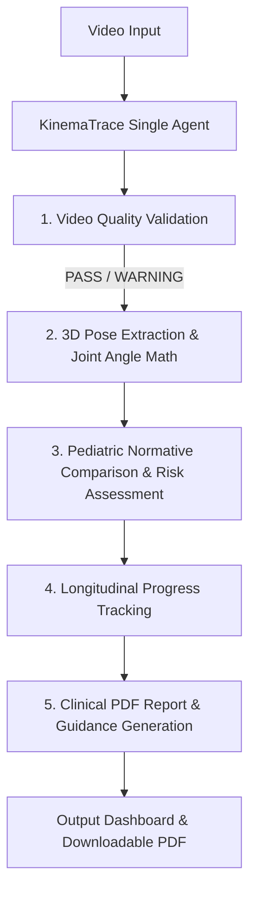
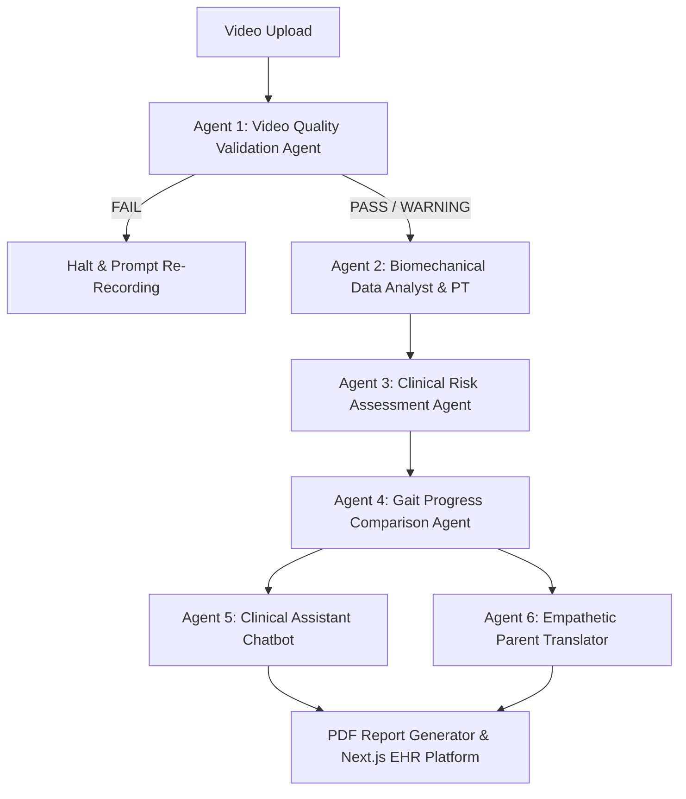

# KinemaTrace AI

> **Pediatric Markerless Gait Screening & Motor Analysis using Computer Vision and AI Agents**

KinemaTrace AI is an advanced clinical decision support platform for early pediatric gait screening. By combining computer vision (MediaPipe BlazePose & OpenCV) with AI agent architectures, KinemaTrace AI analyzes walking videos recorded on standard smartphones to measure joint kinematics, evaluate bilateral symmetry, classify motor risk, track longitudinal progress, and generate clinical PDF reports.

This repository is prepared for **AgentVerse** and contains **BOTH** Single-Agent and Multi-Agent architectural implementations of the platform.

---

## Implementations Overview

| Architecture | Directory | Primary Design | Agent Roster | Key Use Case |
| :--- | :--- | :--- | :--- | :--- |
| **Single-Agent** | [`/Single-Agent`](file:///c:/Users/Muhammed%20Jeseem/Downloads/KinemaTrace-AgentVerse/Single-Agent) | Monolithic Centralized Agent | `KinemaTraceSingleAgent` | Rapid, low-overhead single-pass execution & edge deployment |
| **Multi-Agent** | [`/Multi-Agent`](file:///c:/Users/Muhammed%20Jeseem/Downloads/KinemaTrace-AgentVerse/Multi-Agent) | Collaborative Agent Mesh | 6 Specialized Agents | Scalable EHR platform, web applications, multi-disciplinary review |

Both implementations share the exact same underlying mathematical calculations (`clinical_math.py`), pose extraction engine (`cv_engine.py`), pediatric normatives (`pediatric_normatives.py`), and PDF generator (`pdf_generator.py`).

---

## Architecture Workflows & Diagrams

### 1. Single-Agent Workflow

In the Single-Agent implementation, one central autonomous agent (`KinemaTraceSingleAgent`) manages the complete end-to-end pipeline:



### 2. Multi-Agent Workflow

In the Multi-Agent implementation, specialized agents collaborate across defined API endpoints and payload schemas:



---

## Quick Start & Running Instructions

### Running the Single-Agent Implementation

```bash
cd Single-Agent

# Install dependencies
pip install -r requirements.txt

# Option A: Run Streamlit Interactive App
streamlit run app.py

# Option B: Run via CLI
python single_agent.py --video demo_normative.mp4 --age 2

# Option C: Run Automated Tests
python test_single_agent.py
```

### Running the Multi-Agent Implementation

```bash
cd Multi-Agent

# Install dependencies
pip install -r requirements.txt

# Option A: Run Streamlit Multi-Agent Dashboard
streamlit run app.py

# Option B: Run Full EHR Web Platform (FastAPI + Next.js)
# Terminal 1: Backend
cd backend && python -m uvicorn main:app --port 8000 --reload

# Terminal 2: Frontend
cd frontend && npm install && npm run dev

# Option C: Run Integration Test Suite
python -m pytest test_master_multiagent_workflow.py -v
```

---

## Shared Clinical & Biomechanical Foundation

- **Joint Flexion Angle Computation**: Calculates 3D interior angles at knee and hip vertices from spatial MediaPipe landmark vectors:
  $$\theta = \arccos\left(\frac{\vec{v}_1 \cdot \vec{v}_2}{\|\vec{v}_1\| \|\vec{v}_2\|}\right) \times \frac{180}{\pi}$$
- **Bilateral Symmetry Index (SI)**:
  $$\text{SI} = 100 \times \frac{|\text{Left} - \text{Right}|}{0.5 \times (|\text{Left}| + |\text{Right}|)}$$
- **Gait Symmetry Percentage**:
  $$\text{Gait Symmetry \%} = \max(0, 100 - \text{SI})$$
- **Pediatric Normatives**: Age-stratified thresholds for toddlers aged 1–4 years (`pediatric_normatives.py`).

---

## Repository Structure

```
KinemaTrace-AgentVerse/
├── Single-Agent/
│   ├── single_agent.py          # Unified single-agent orchestrator
│   ├── app.py                   # Streamlit dashboard for single-agent
│   ├── clinical_math.py         # Shared kinematic math functions
│   ├── cv_engine.py             # Shared OpenCV/MediaPipe pose engine
│   ├── pediatric_normatives.py  # Shared pediatric reference ranges
│   ├── pdf_generator.py         # Shared clinical PDF generator
│   ├── test_single_agent.py     # Single-agent automated test suite
│   ├── requirements.txt         # Single-agent dependencies
│   └── README.md                # Single-agent documentation
│
├── Multi-Agent/
│   ├── app.py                   # Streamlit dashboard for multi-agent
│   ├── backend/                 # FastAPI server & specialized agent modules
│   ├── frontend/                # Next.js EHR React application
│   ├── agents/                  # Multi-agent package definitions
│   ├── clinical_math.py         # Shared kinematic math functions
│   ├── cv_engine.py             # Shared OpenCV/MediaPipe pose engine
│   ├── pediatric_normatives.py  # Shared pediatric reference ranges
│   ├── pdf_generator.py         # Shared clinical PDF generator
│   ├── test_master_multiagent_workflow.py  # Multi-agent test suite
│   ├── requirements.txt         # Multi-agent dependencies
│   └── README.md                # Multi-agent documentation
│
└── README.md                    # Root Master AgentVerse Documentation
```
